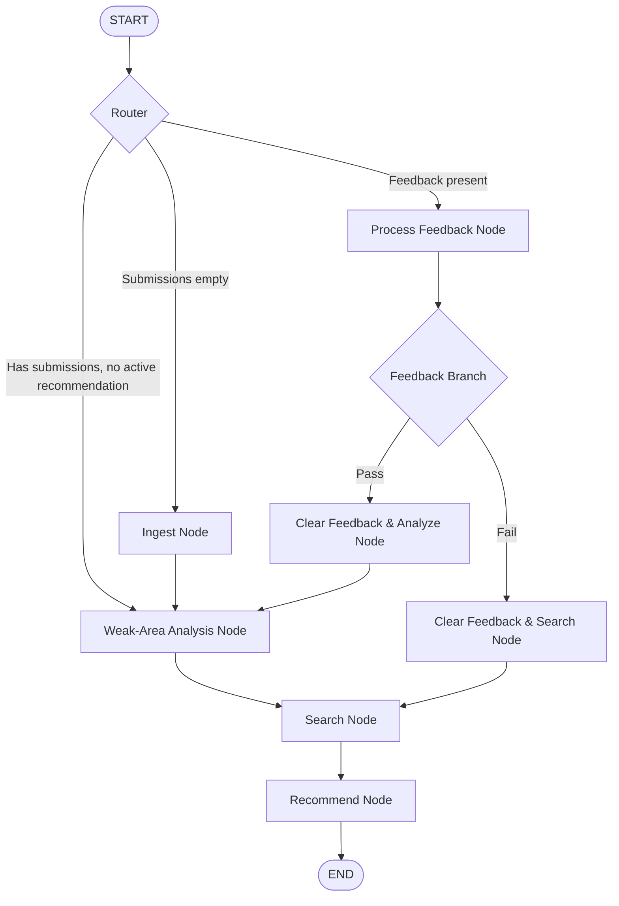

# CPCoach 🎓

CPCoach is an agentic competitive programming recommendation coach built using **LangGraph** and **Streamlit**. It automatically analyzes a user's Codeforces history (via API or local CSV fallback), calculates topic weaknesses using attempts-weighted statistics, recommends target problems, and updates difficulty dynamically using a feedback-based loop.

---

## 📐 Algorithms & Logic

### 1. Weakness Score Formula
To identify weak topics, we compute a weighted score ($W$) for each topic tag:
$$W = (1 - R) \times \ln(1 + |U|)$$
Where:
*   $U$ is the set of unique problems attempted under the tag.
*   $S$ is the set of unique problems solved (verdict `"OK"`) under the tag.
*   $R = \frac{|S|}{|U|}$ is the user's solve rate for the tag.

**Why this formula?**
If a user attempts 10 DP problems and solves 2, the solve rate $R = 0.2$ and attempts $|U| = 10$.
$$W_{\text{DP}} = 0.8 \times \ln(11) \approx 1.918$$
If a user attempts 1 Math problem and fails, the solve rate $R = 0$ and attempts $|U| = 1$.
$$W_{\text{Math}} = 1.0 \times \ln(2) \approx 0.693$$
This ensures the agent focuses on tags with persistent failures over isolated ones, ranking DP as a weaker area than Math.

---

### 2. Rating Target Calculation
1.  **Tag-specific solved average:** If the user has solved problems with the target tag, the baseline is the average rating of those solved problems, rounded to the nearest 100.
2.  **Overall solved average:** If the user has *no* solved problems for this tag, the baseline is their average solved rating across all other tags.
3.  **Global default:** If the user has never solved a problem, the baseline defaults to `800` (Codeforces floor).
4.  **Initial target:** The recommended difficulty begins at `baseline + 100` (one step harder).

---

### 3. Difficulty-Adjustment & Feedback Loop
*   **✅ Pass (Solved):** The target rating for that tag increases by $+100$ for the next recommendation, and the state loops back to **Weak-Area Analysis** to re-evaluate the overall weakest tag.
*   **❌ Fail (Stuck/Failed):** The target rating for that tag decreases by $-100$ (clamped to a minimum of `800`) and loops directly back to **Search** to recommend an easier problem under the same tag.

---

### 4. Dynamic Rating Band Widening
When searching for candidate problems:
1.  Query exact target rating: $T_{\text{target}}$.
2.  If 0 results are returned, expand search window to $[T_{\text{target}} - 100, T_{\text{target}} + 100]$.
3.  Widen the window iteratively by $\pm 100$ up to $\pm 1000$.
4.  **Fallback:** If still no matching unsolved problems are found (e.g. extremely high target rating like 3500), the agent ignores rating bounds entirely and recommends any unsolved problem matching the weak tag in the database to prevent crashes.

---

## 🏗️ Architecture (LangGraph State Machine)

The workflow is modeled as an explicit state machine:



---

## ⚙️ Setup and Run Instructions

### Option A: Quick Setup (Auto-install & Run)
We provide a setup script that creates the virtual environment, updates dependencies, copies configuration templates, and runs the application automatically.
```bash
./run.sh
```

### Option B: Manual Local Setup
1.  **Install dependencies in a virtual environment:**
    ```bash
    python3 -m venv venv
    source venv/bin/activate
    pip install -r requirements.txt
    ```
2.  **Configure environment:** Create a `.env` file at the root directory and add your Groq API key:
    ```env
    GROQ_API_KEY=your_groq_api_key_here
    ```
3.  **Launch the Streamlit app:**
    ```bash
    streamlit run src/app.py
    ```

---

## 🐳 Docker Deployment

### 1. Run using Docker Compose (Recommended)
Make sure you have a `.env` file at the root containing your API key, then run:
```bash
docker-compose up --build
```
The app will build and run on [http://localhost:8501](http://localhost:8501).

### 2. Manual Docker Build & Run
```bash
docker build -t cpcoach .
docker run -p 8501:8501 --env GROQ_API_KEY=gsk_your_key cpcoach
```

---

## 🌐 Cloud Deployment (Streamlit Community Cloud)

To share this app publicly so anyone can access it:
1.  Push this codebase to a public **GitHub** repository.
2.  Go to [Streamlit Community Cloud](https://share.streamlit.io/) and click **New app**.
3.  Select your repository, branch, and set main file path to `src/app.py`.
4.  Expand **Advanced settings** -> **Secrets** and add your Groq API Key:
    ```toml
    GROQ_API_KEY = "gsk_your_key_here"
    ```
5.  Click **Deploy**! Streamlit will package the app and host it for free.

---

## 🧪 Walkthrough & Automated Test Logs

Here is the actual execution path verified by the automated script:

### Cycle 1: Ingestion & Analysis
*   **Weakness metrics computed:**
    *   `graphs` has 3 attempts, 0 solves (Solve rate: 0.0%) $\rightarrow$ Weakness score: $1.386$
    *   `dp` has 3 attempts, 1 solve (Solve rate: 33.3%) $\rightarrow$ Weakness score: $1.099$
    *   `math` has 4 attempts, 3 solves (Solve rate: 75%) $\rightarrow$ Weakness score: $0.693$
*   **Target Tag Chosen:** `graphs` (Weakest).
*   **Initial Target Rating:** `1200`
*   **Problem Recommended:** `977D - Divide by three, multiply by two` (Rating: 1100).
*   **Coach Rationale:** *"This problem is recommended because it focuses on 'graphs' at rating 1100, which is currently your top weak area."*

### Cycle 2: Fail Loop (Stuck/Failed)
*   **Feedback:** User reports **Fail** on `977D`.
*   **Adjustment:** Target rating for `graphs` decreases from `1200` to `1100`.
*   **Next Problem:** `1676G - White-Black Balanced Subtrees` (Rating: 1100).

### Cycle 3: Pass Loop (Solved)
*   **Feedback:** User reports **Pass** on `1676G`.
*   **Adjustment:** Target rating for `graphs` increases from `1100` to `1200`.
*   **Next step:** Recompute weaknesses. The tag remains `graphs` (since it's still weakest), and the next problem is recommended: `1020B - Badge` (Rating: 1000).

### Cycle 4: Search Band Widening (Extreme Rating Target)
*   **Query Target:** User rating for `graphs` forced to `3500`.
*   **Behavior:** Widening by $\pm 1000$ yields 0 results. Fallback triggered:
*   **Recommends:** `520B - Two Buttons` (Rating: 1000) (ignores rating bounds, prevents crash).

---

## 🛠️ Issues Faced & Resolutions

1.  **Type Error in Set Comprehension:**
    *   *Issue:* Concatenating `contestId` (integer) and `index` (string) caused a `TypeError` in `recommended_ids = {hist["problem"]["contestId"] + str(hist["problem"]["index"]) ...}`.
    *   *Fix:* Cast `contestId` to string: `str(hist["problem"]["contestId"])`.
2.  **Search Node returning Null (None) for Extreme Queries:**
    *   *Issue:* When testing search widening with `rating = 3500` (beyond the range of any graph problem in our database), the loop terminated with 0 candidates, causing subsequent nodes to crash.
    *   *Fix:* Added an explicit fallback inside `search_node` that catches empty candidates after widening and selects *any* unsolved problem matching the tag regardless of rating.
